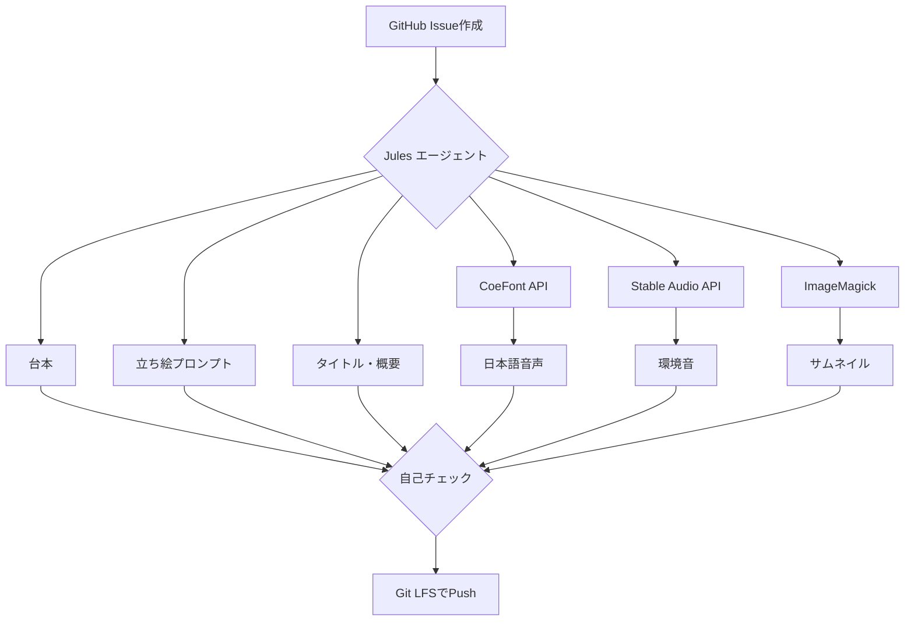

# プロジェクト概要とアーキテクチャ

## 1. 概要

このプロジェクトは、GitHub Issueをトリガーとして、一連の動画制作用アセットを全自動で生成するパイプラインです。Jules（Geminiエージェント）がIssueの内容を解釈し、台本作成からサムネイル生成まで、人間を介さずに一気通貫で処理を実行します。

最終的な目標は、定期的な動画コンテンツ制作の大部分を自動化し、クリエイターがより創造的な作業に集中できる環境を構築することです。

## 2. アーキテクチャ

本パイプラインは、中央に位置する**Jules（Geminiエージェント）**が各種クラウドサービスやローカルツールを連携させるハブとして機能するアーキテクチャです。

**処理の流れ:**

1.  **トリガー**: ユーザーがGitHub上で特定のテンプレートを用いてIssueを作成します。
2.  **エージェント起動**: Web UIを通じてJulesエージェントが起動され、対象のIssueを処理します。
3.  **アセット生成**:
    - JulesがIssueの内容を解釈し、内部でGemini 2.5 Proを利用して、台本、立ち絵のプロンプト、動画タイトル、概要を生成します。
    - 生成された台本を元に、**CoeFont**がナレーション音声を生成します。
    - 動画のテーマに沿った環境音を**Stable Audio**が生成します。
4.  **サムネイル合成**:
    - Julesが内部の画像生成モデルを利用し、立ち絵画像を生成します。
    - **ImageMagick**を使い、背景、立ち絵、テキストを合成してサムネイルを完成させます。
5.  **デプロイ**:
    - 全てのアセットが所定のフォーマット（サイズ、形式）に準拠しているか自己チェックを行います。
    - 問題がなければ、全アセットを**Git LFS**経由でリポジトリにPushします。

## 3. 自動化の対象

このパイプラインによって、以下の項目が自動生成されます。

- **台本**: 動画のシナリオやナレーション原稿。
- **立ち絵**: 動画に登場するキャラクターの画像。
- **ナレーション音声**: 台本を元にした日本語の合成音声。
- **環境音 (BGM)**: 動画の雰囲気を演出するサウンド。
- **サムネイル**: 動画のクリックを促すための画像。
- **動画タイトル**: SEOや視聴者の興味を考慮したタイトル。
- **動画概要欄**: 動画の内容を説明するテキスト。
- **メタデータ**: 生成したアセット情報をまとめたJSONファイル。
